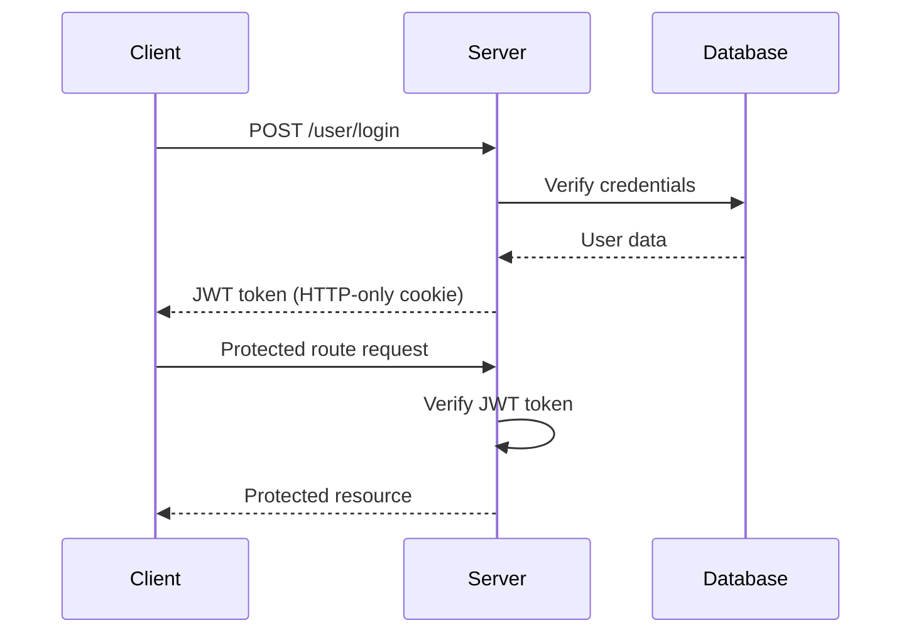
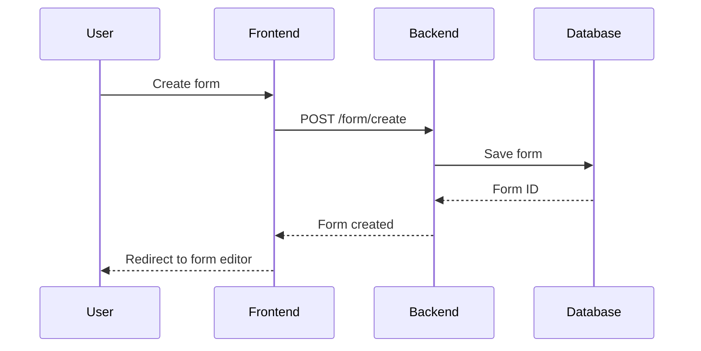

# 📋 Feedback Form Builder

A modern, full-stack web application for creating, managing, and analyzing custom feedback forms with real-time analytics and response management.


## 🚀 Features

### 📝 Form Creation & Management
- **Dynamic Form Builder**: Create forms with multiple question types (short answer, paragraph, multiple choice, checkboxes, dropdown, file upload)
- **Real-time Form Editor**: Live preview and editing capabilities
- **Form Templates**: Quick start with pre-built templates
- **Form Settings**: Control response collection, confirmation messages, and access permissions

### 📊 Analytics & Insights
- **Response Analytics**: Real-time visualization of form responses
- **Data Export**: Export responses in multiple formats
- **Response Management**: View, filter, and manage individual responses
- **Form Performance**: Track completion rates and engagement metrics

### 🔐 Authentication & Security
- **Secure Authentication**: JWT-based authentication with HTTP-only cookies
- **User Management**: Registration, login, and profile management
- **Protected Routes**: Role-based access control
- **Data Privacy**: Secure data handling and storage

### 🎨 User Experience
- **Responsive Design**: Mobile-first approach with TailwindCSS
- **Intuitive Interface**: Clean, modern UI with smooth interactions
- **Real-time Updates**: Live form preview and instant feedback
- **Loading States**: Comprehensive loading and error handling

## 🏗️ System Architecture

```
┌─────────────────┐    HTTP/HTTPS     ┌─────────────────┐
│                 │◄─────────────────►│                 │
│   Frontend      │                   │   Backend       │
│   (React SPA)   │                   │   (Node.js)     │
│                 │                   │                 │
└─────────────────┘                   └─────────────────┘
         │                                       │
         │                                       │
         ▼                                       ▼
┌─────────────────┐                   ┌─────────────────┐
│   Browser       │                   │   MongoDB       │
│   Storage       │                   │   Database      │
│                 │                   │                 │
└─────────────────┘                   └─────────────────┘
```

### Technology Stack

#### Frontend
- **React 18.2.0** - Modern UI library with hooks
- **React Router DOM** - Client-side routing
- **Axios** - HTTP client with interceptors
- **TailwindCSS** - Utility-first CSS framework
- **Vite** - Fast build tool and development server
- **React Hook Form** - Efficient form handling

#### Backend
- **Node.js** - JavaScript runtime environment
- **Express.js** - Web application framework
- **MongoDB** - NoSQL database
- **Mongoose** - MongoDB object modeling
- **JWT** - JSON Web Tokens for authentication
- **bcrypt** - Password hashing
- **Multer** - File upload handling
- **Cloudinary** - Cloud image storage

#### Development Tools
- **ESLint** - Code linting and formatting
- **Prettier** - Code formatting
- **Nodemon** - Development server auto-restart
- **CORS** - Cross-origin resource sharing

## 📁 Project Structure

```
feedback/
├── Backend/                    # Server-side application
│   ├── controllers/           # Route controllers
│   │   ├── user.controller.js
│   │   ├── form.controller.js
│   │   └── store.controller.js
│   ├── models/                # Database models
│   │   ├── user.model.js
│   │   ├── form.model.js
│   │   └── store.model.js
│   ├── routes/                # API routes
│   │   ├── user.route.js
│   │   ├── form.routes.js
│   │   └── store.route.js
│   ├── middleware/            # Custom middleware
│   │   ├── auth.middleware.js
│   │   └── multer.middleware.js
│   ├── utils/                 # Utility functions
│   │   ├── ApiError.js
│   │   ├── ApiResponse.js
│   │   └── asyncHandler.js
│   ├── uploads/               # File upload directory
│   ├── .env                   # Environment variables
│   ├── app.js                 # Express app configuration
│   ├── server.js              # Server entry point
│   └── package.json
│
├── Frontend/                   # Client-side application
│   ├── src/
│   │   ├── components/        # Reusable UI components
│   │   ├── pages/             # Page components
│   │   ├── Context/           # React Context providers
│   │   ├── utils/             # Utility functions
│   │   │   └── api.js         # Centralized API management
│   │   ├── assets/            # Static assets
│   │   ├── App.jsx            # Main application component
│   │   └── main.jsx           # Application entry point
│   ├── public/                # Static public files
│   ├── .env                   # Environment variables
│   ├── index.html             # HTML entry point
│   ├── package.json
│   ├── tailwind.config.js     # TailwindCSS configuration
│   └── vite.config.js         # Vite configuration
│
└── README.md                   # Project documentation
```

## 🛠️ Installation & Setup

### Prerequisites
- **Node.js** (v16 or higher)
- **MongoDB** (v4.4 or higher)
- **npm** or **yarn**
- **Git**

### Backend Setup

1. **Clone the repository**
   ```bash
   git clone https://github.com/anuj308/feedback.git
   cd feedback/Backend
   ```

2. **Install dependencies**
   ```bash
   npm install
   ```

3. **Environment Configuration**
   Create a `.env` file in the Backend directory:
   ```env
   # Database Configuration
   MONGODB_URI=mongodb://localhost:27017/feedback-app
   DB_NAME=feedback

   # Server Configuration
   PORT=9000

   # CORS Configuration
   CORS_ORIGIN=http://localhost:5173

   # JWT Configuration
   ACCESS_TOKEN_SECRET=your-super-secret-jwt-key-here
   ACCESS_TOKEN_EXPIRY=1d
   REFRESH_TOKEN_SECRET=your-refresh-token-secret-here
   REFRESH_TOKEN_EXPIRY=10d

   # Cloudinary Configuration (Optional)
   CLOUDINARY_CLOUD_NAME=your-cloud-name
   CLOUDINARY_API_KEY=your-api-key
   CLOUDINARY_API_SECRET=your-api-secret

   # Environment
   NODE_ENV=development
   ```

4. **Start the backend server**
   ```bash
   # Development mode
   npm run dev

   # Production mode
   npm start
   ```

   The backend server will start on `http://localhost:9000`

### Frontend Setup

1. **Navigate to frontend directory**
   ```bash
   cd ../Frontend
   ```

2. **Install dependencies**
   ```bash
   npm install
   ```

3. **Environment Configuration**
   Create a `.env` file in the Frontend directory:
   ```env
   # API Configuration
   VITE_API_BASE_URL=/api/v1
   VITE_BACKEND_URL=http://localhost:9000

   # Environment
   VITE_NODE_ENV=development

   # Debug flags
   VITE_DEBUG_API=true
   VITE_DEBUG_COMPONENTS=false

   # App configuration
   VITE_APP_NAME=Feedback Form Builder
   VITE_APP_VERSION=1.0.0
   ```

4. **Start the frontend development server**
   ```bash
   npm run dev
   ```

   The frontend application will start on `http://localhost:5173`

## 🚀 Usage

### Getting Started

1. **Access the application** at `http://localhost:5173`
2. **Create an account** or login with existing credentials
3. **Create your first form** using the intuitive form builder
4. **Share your form** with respondents
5. **Analyze responses** using the built-in analytics dashboard

### API Endpoints

#### Authentication
- `POST /api/v1/user/register` - User registration
- `POST /api/v1/user/login` - User login
- `POST /api/v1/user/logout` - User logout
- `GET /api/v1/user/current-user` - Get current user

#### Forms Management
- `POST /api/v1/form/create` - Create new form
- `GET /api/v1/form/f/:id` - Get form by ID
- `PATCH /api/v1/form/f/:id` - Update form
- `DELETE /api/v1/form/f/:id` - Delete form
- `GET /api/v1/form/o/:ownerId` - Get forms by owner

#### Response Management
- `POST /api/v1/store` - Submit form response
- `GET /api/v1/store/f/:formId` - Get responses for form
- `GET /api/v1/form/analytics/:id` - Get form analytics

## 🧪 Testing

### Running Tests
```bash
# Backend tests
cd Backend
npm test

# Frontend tests
cd Frontend
npm test
```

### Manual Testing
1. Test user registration and login
2. Create and edit forms with different question types
3. Submit responses and verify data persistence
4. Test responsive design on different devices
5. Verify authentication and authorization flows

## 📝 API Documentation

### Authentication Flow


### Form Creation Flow


## 🔧 Configuration

### Development Configuration
- **Hot Reload**: Enabled for both frontend and backend
- **CORS**: Configured for local development
- **Proxy**: Vite proxy setup for API calls
- **Environment Variables**: Separate configs for dev/prod

### Production Configuration
- **Build Optimization**: Minified and optimized builds
- **Security Headers**: Implemented security best practices
- **Error Handling**: Comprehensive error logging
- **Performance**: Optimized for production deployment

## 🚀 Deployment

### Frontend Deployment (Vercel/Netlify)
```bash
# Build for production
npm run build

# Preview production build
npm run preview
```

### Backend Deployment (Heroku/Railway)
```bash
# Set environment variables
# Deploy using platform-specific commands
```

### Database Setup (MongoDB Atlas)
1. Create MongoDB Atlas cluster
2. Update connection string in environment variables
3. Configure network access and user permissions

## 🤝 Contributing

1. **Fork the repository**
2. **Create a feature branch** (`git checkout -b feature/amazing-feature`)
3. **Commit changes** (`git commit -m 'Add amazing feature'`)
4. **Push to branch** (`git push origin feature/amazing-feature`)
5. **Open a Pull Request**

### Code Style
- Follow ESLint configuration
- Use Prettier for code formatting
- Write meaningful commit messages
- Add tests for new features

## 📄 License

This project is licensed under the ISC License - see the [LICENSE](LICENSE) file for details.

## 👥 Authors

- **Anuj Kumar Sharma** - *Initial work* - [anuj308](https://github.com/anuj308)

## 🙏 Acknowledgments

- React team for the amazing framework
- Express.js community for the robust backend framework
- MongoDB team for the flexible database solution
- TailwindCSS for the utility-first CSS framework

## 📞 Support

For support, email anujkumarsharma2023@gmail.com or create an issue in the GitHub repository.

## 🔄 Changelog

### v1.0.0 (Current)
- Initial release with core functionality
- User authentication and authorization
- Form creation and management
- Response collection and analytics
- Responsive design implementation

---

Made with ❤️ by [Anuj Kumar Sharma](https://github.com/anuj308)
